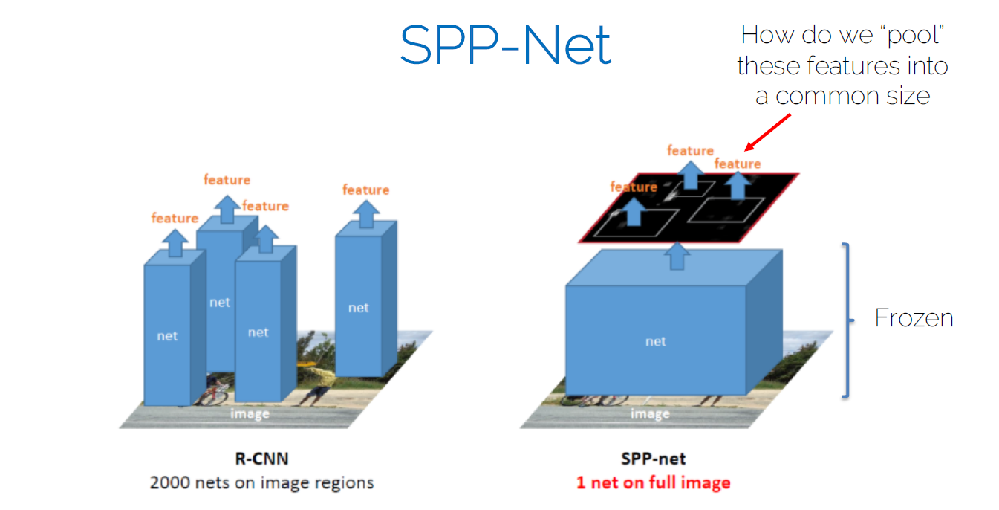

# CV TUM

## Two-stage object detectors(part2)

Overfeat

• Sliding window + box regression + classification

• In practice: use many sliding window locations and
multiple scales

## object detection(part1) 

We need a generic, class-agnostic objectness
measure: how likely it is for an image region to
contain an object

Using this measure yields a number of candidate
object proposals or regions of interest (RoI) where to
focus ( as the first step of 2 stage OD) 

Classic Object proposal methods

• Selective search: van de Sande et al. Segmentation
as selective search for object recognition. ICCV 2011.

• Edge boxes: Zitnick and Dollar. Edge boxes: locating
object proposals from edges. ECCV 2014.

Do we want all proposals?

• Many boxes trying to explain one object

• We need a method to keep only the “best” boxes

Types of object detectors

R-CNN

• Training scheme(in a non end-to-end manner):

– 1. Pre-train the CNN on ImageNet

– 2. Finetune the CNN on the number of classes the
detector is aiming to classify (softmax loss)

– 3. Train a linear Support Vector Machine classifier to
classify image regions. One SVM per class! (hinge loss)

– 4. Train the bounding box regressor (L2 loss)

• PROS:

– The pipeline of proposals, feature extraction and SVM
classification is well-known and tested. Only features are
changed (CNN instead of HOG).

– CNN summarizes each proposal into a 4096 vector
(much more compact representation compared to HOG)

– Leverage transfer learning: the CNN can be pre-trained
for image classification with C classes. One needs only to
change the FC layers to deal with Z classes.

• CONS:

– Slow! 47s/image with VGG16 backbone. One considers
around 2000 proposals per image, they need to be
warped and forwarded through the CNN.

– Training is also slow and complex

– The object proposal algorithm is fixed. Feature extraction
and SVM classifier are trained separately à not exploiting
learning to its full potential.

SPP-Net

• It solved the R-CNN problem of being slow at test
time

• It still has some problems inherited from R-CNN:

– Training is still slow (a bit faster than R-CNN)

– Training scheme is still complex

– Still no end-to-end training

Fast R-CNN(yayyy)

[CV3DST - One-stage Object Detectors](https://www.youtube.com/watch?v=J9LSeOGoNW0&list=PLog3nOPCjKBneGyffEktlXXMfv1OtKmCs&index=5) till: 37mins

[CV3DST - Object tracking](https://www.youtube.com/watch?v=QtAYgtBnhws&list=PLog3nOPCjKBneGyffEktlXXMfv1OtKmCs&index=6) till : 57mins

What is the difference between HOG, SIFT and CNN?

The difference and similarities between them are:

HOG

Stands for histogram of oriented gradients. Which is based on first order image gradients. The image gradients are pooled into overlapping oriention bins in a dense manner.

HOG is:

Based on first order image gradients pooled in orientation bins.
Dense (evaluated all over the image)
Hand engineered, no learning algorithms for HOG features.
SIFT

Which stands for scale invariant feature transform is similar to HOG only that SIFT is specifically a 128 dimensional vector that summarizes/describes a 16×16 window patch. The SIFT is obtained by dividing the 16×16 window into 4×4 bins. Each bin has 8 orientation bins or channels. So that makes the dimensionality of SIFT descriptor equal to

4×4×8 = 128

SIFT is:

Based on first order gradients
Course, that is, it is evaluated around scale invariant feature points obtained using the difference of gaussian (DoG) key point detector. There is a dense variant known as the dense-SIFT.
Hand engineered and thus does not learn the representation by itself, it is hard coded.
CNN

Stands for convolutional neural network, this is a hierarchical deep learning architecture. It is based on repeated convolutional operations which repeatedly filter the signal at each stage. The filters are trainable, that is, they learn to adapt to the task at hand during learning.

CNNs are:

Trainable feature detectors which makes them highly adaptive. That is why they can achieve high accuracy levels in most applications such as image recognition. They can be trained end-to-end.
Mainly supervised deep learning models motivated by the primary visual cortex with alternating layers of convolutions and pooling layers.
They can learn low-level features similar to SIFT and HOG features from training examples alone, that is amazing. Thus one can minimize feature engineering when it comes to using CNNs.
Thus SIFT and HOG features are low-level features which don't make use of hierarchical layer-wise representation learning while the CNN is a hierarchical deep learning model which is able to model data at more and more abstract representations.

# ADL4CV - Advanced Deep Learning for Computer Vision

## Part1 Visualization and Interpretability

[ADL4CV - Visualization and Interpretability](https://www.youtube.com/watch?v=4M-kuW2huqU&list=PLog3nOPCjKBkngkkF552-Hiwa5t_ZeDnh&index=2) till 38mins

### Visualizing importance

The occlusion experiment

• Block different parts of the image and see how the
classification score changes

• Create a map, where each pixel represents the
classification probability if an occlusion square is
placed in that region

### Visualizing features

1. DeconvNet: using the DeconvNet architecture to
visualize features at a certain layer

DeconvNet: 

  (1)Kernel transpose
  
  (2)inverting ReLU
  
  (3) Max pool invert
  

 2. Gradient ascent: generate a synthetic image that
maximally activates a filter

