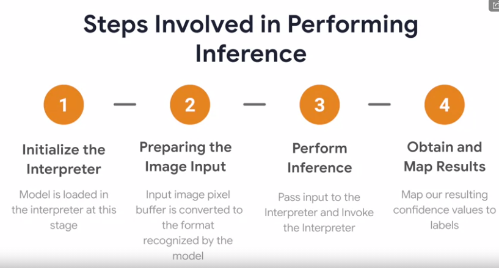
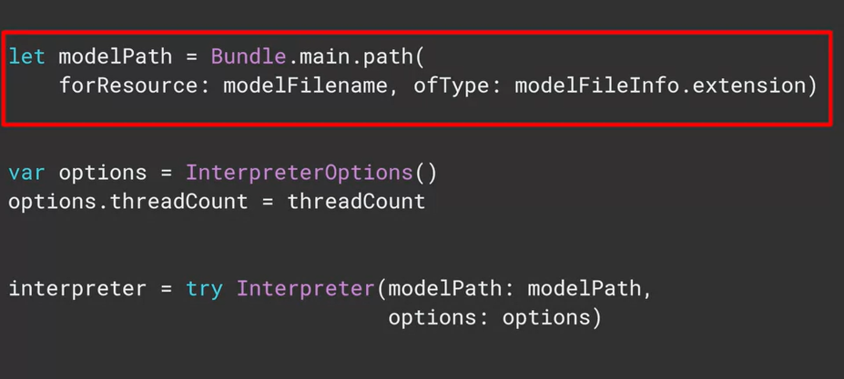
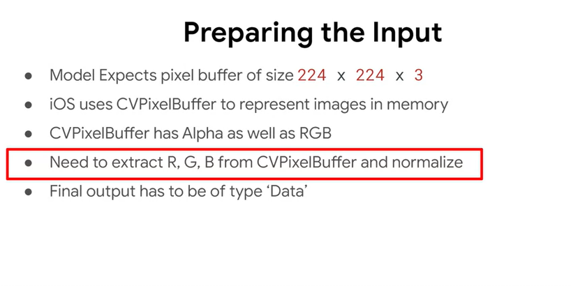
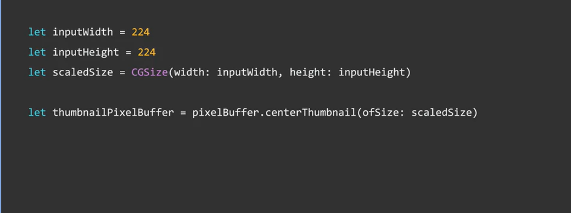
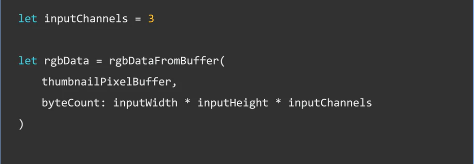
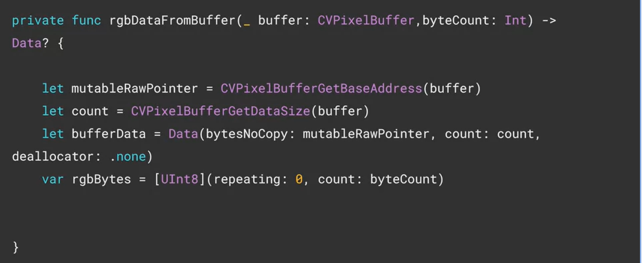
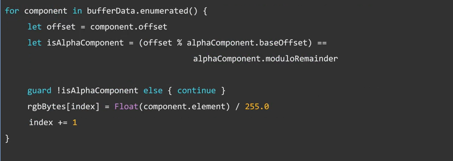

# Deployment

Cats vs Dogs App

view controller( display image & result) 

ModelDataHandler ( preprocess + infer ) 
( The model data handler is written so as to modularize
the code and move all of the model-related manipulation i
nto one class for the sake of clarity in this example.) 

TensorflowLite Interpreter

We'll first go through the calls made to the TensorFlow Lite library to perform inference. 

Towards the end, I'll be explaining how the ViewController hands over the pixel buffer to the model data handler.

TensorFlow Lite inference. Inference is performed by the class named interpreter, in the TensorFlow Lite library. 

step1 : 

The interpreter is added to your app using the pod file 

about [CVPixelBuffer](https://developer.apple.com/documentation/corevideo/cvpixelbuffer-q2e)

You begin by creating a reference to the model file. If you copied it as shown earlier, it will be in the app bundles main path. So you can point the model path variable at bundle.main.path, specifying the file name and type. Next you define the interpreter options. So for example. If you want to specify a thread count, you can do so in the options object. IOS doesn't support the Android neural networks API, so that option is not available here. Then you simply instantiate the interpreter, passing it the path of the model and the options that you want to use. Next up, you'll want to allocate input tensors to reserve memory for them. It's a straightforward as calling the allocate tensors method on the initialized interpreter. The next step is to prepare the image input. 

The next step is to prepare the image input. This can be a pretty complex task because of the differences of how the operating system

he first thing is to scale the image.

about [vImag](https://developer.apple.com/documentation/accelerate/vimage)

# CV TUM

## Two-stage object detectors(part2)

Overfeat

• Sliding window + box regression + classification

• In practice: use many sliding window locations and
multiple scales

## object detection(part1) 

We need a generic, class-agnostic objectness
measure: how likely it is for an image region to
contain an object

Using this measure yields a number of candidate
object proposals or regions of interest (RoI) where to
focus ( as the first step of 2 stage OD) 

Classic Object proposal methods

• Selective search: van de Sande et al. Segmentation
as selective search for object recognition. ICCV 2011.

• Edge boxes: Zitnick and Dollar. Edge boxes: locating
object proposals from edges. ECCV 2014.

Do we want all proposals?

• Many boxes trying to explain one object

• We need a method to keep only the “best” boxes

Types of object detectors

# ADL4CV - Advanced Deep Learning for Computer Vision

## Part1 Visualization and Interpretability

(https://www.youtube.com/watch?v=4M-kuW2huqU&list=PLog3nOPCjKBkngkkF552-Hiwa5t_ZeDnh&index=2)@38mins

### Visualizing importance

The occlusion experiment

• Block different parts of the image and see how the
classification score changes

• Create a map, where each pixel represents the
classification probability if an occlusion square is
placed in that region

### Visualizing features

1. DeconvNet: using the DeconvNet architecture to
visualize features at a certain layer

DeconvNet: 

  (1)Kernel transpose
  
  (2)inverting ReLU
  
  (3) Max pool invert
  

 2. Gradient ascent: generate a synthetic image that
maximally activates a filter

