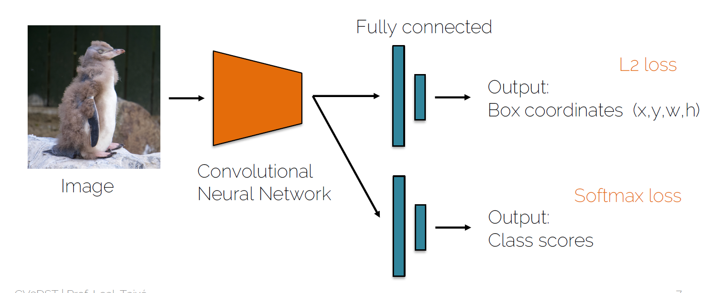
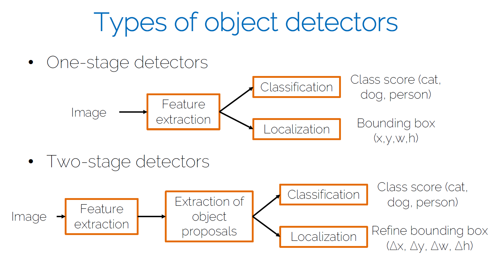

# ADL4CV - Advanced Deep Learning for Computer Vision

## Part1 Visualization and Interpretability

(https://www.youtube.com/watch?v=4M-kuW2huqU&list=PLog3nOPCjKBkngkkF552-Hiwa5t_ZeDnh&index=2)@38mins

### Visualizing importance

The occlusion experiment

• Block different parts of the image and see how the
classification score changes

• Create a map, where each pixel represents the
classification probability if an occlusion square is
placed in that region

### Visualizing features

1. DeconvNet: using the DeconvNet architecture to
visualize features at a certain layer

DeconvNet: 

  (1)Kernel transpose
  
  (2)inverting ReLU
  
  (3) Max pool invert
  

 2. Gradient ascent: generate a synthetic image that
maximally activates a filter

# CV TUM

## Two-stage object detectors(part2)

## object detection(part1) 

We need a generic, class-agnostic objectness
measure: how likely it is for an image region to
contain an object

Using this measure yields a number of candidate
object proposals or regions of interest (RoI) where to
focus ( as the first step of 2 stage OD) 

Classic Object proposal methods

• Selective search: van de Sande et al. Segmentation
as selective search for object recognition. ICCV 2011.

• Edge boxes: Zitnick and Dollar. Edge boxes: locating
object proposals from edges. ECCV 2014.

Do we want all proposals?

• Many boxes trying to explain one object

• We need a method to keep only the “best” boxes

Types of object detectors

