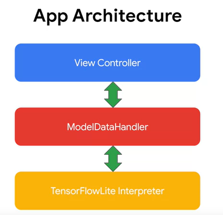
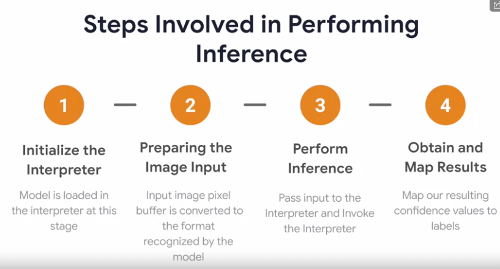
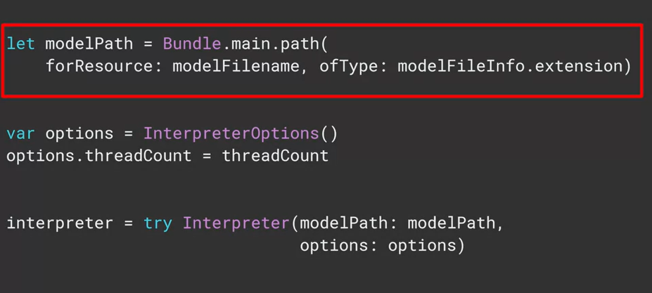
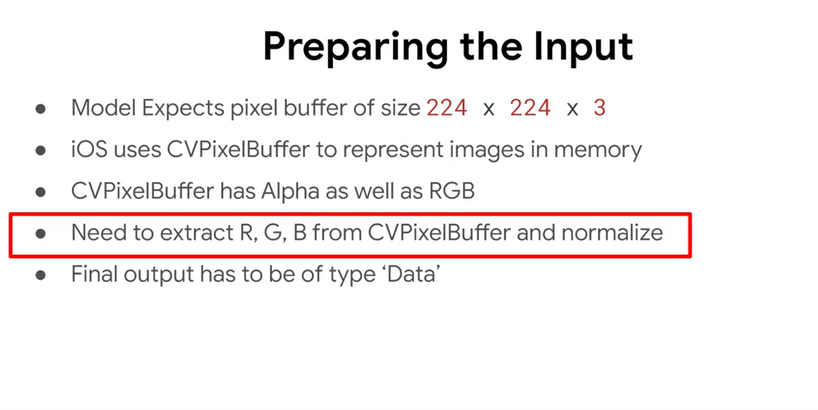
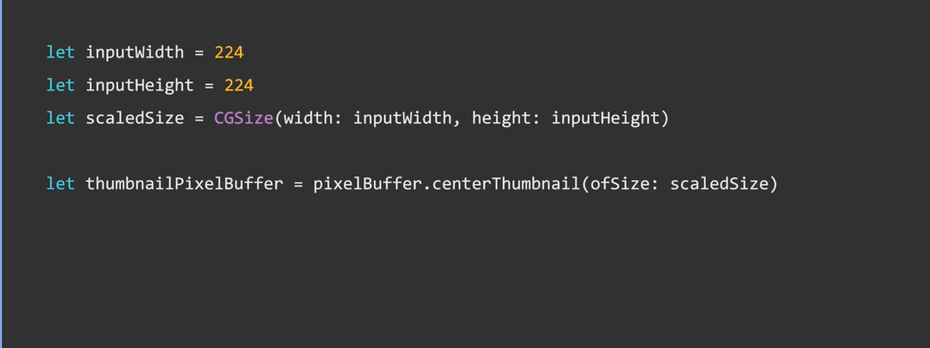
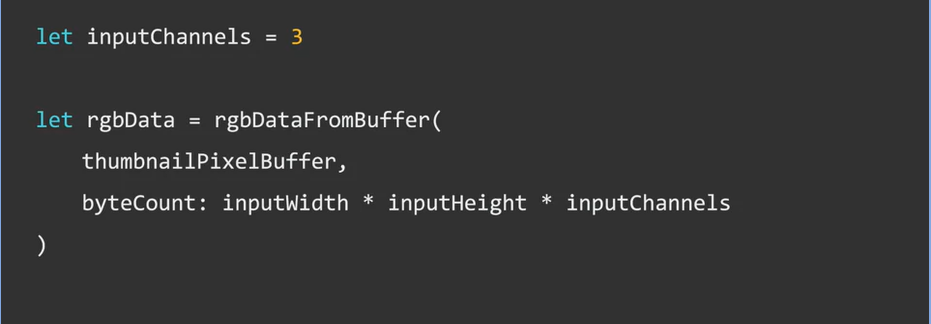
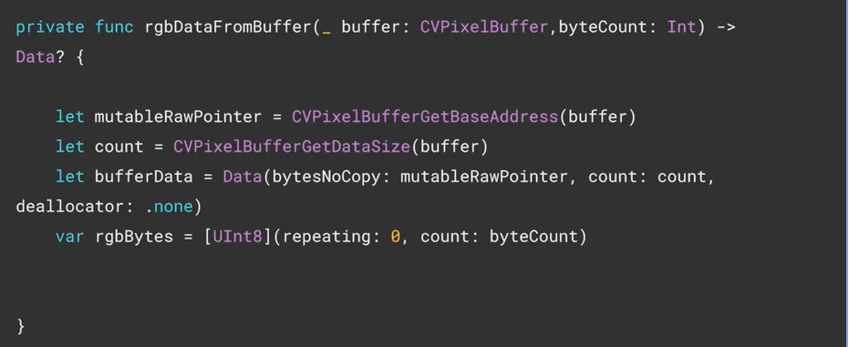
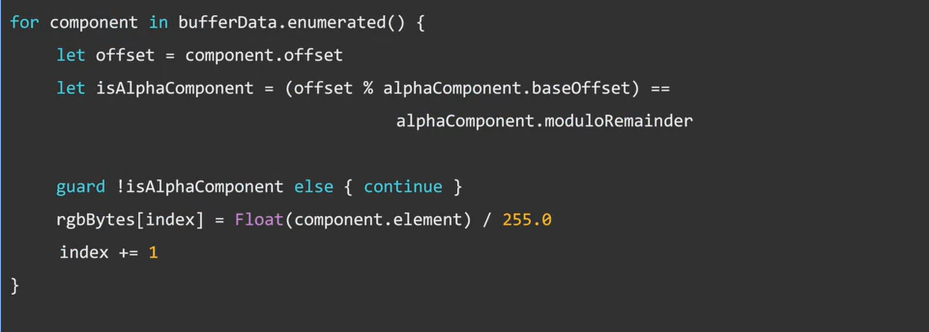

# Deployment

Cats vs Dogs App

view controller( display image & result) 

ModelDataHandler ( preprocess + infer ) 
( The model data handler is written so as to modularize
the code and move all of the model-related manipulation i
nto one class for the sake of clarity in this example.) 

TensorflowLite Interpreter

We'll first go through the calls made to the TensorFlow Lite library to perform inference. 

Towards the end, I'll be explaining how the ViewController hands over the pixel buffer to the model data handler.

TensorFlow Lite inference. Inference is performed by the class named interpreter, in the TensorFlow Lite library. 

step1 : 

The interpreter is added to your app using the pod file 

about [CVPixelBuffer](https://developer.apple.com/documentation/corevideo/cvpixelbuffer-q2e)

You begin by creating a reference to the model file. If you copied it as shown earlier, it will be in the app bundles main path. So you can point the model path variable at bundle.main.path, specifying the file name and type. Next you define the interpreter options. So for example. If you want to specify a thread count, you can do so in the options object. IOS doesn't support the Android neural networks API, so that option is not available here. Then you simply instantiate the interpreter, passing it the path of the model and the options that you want to use. Next up, you'll want to allocate input tensors to reserve memory for them. It's a straightforward as calling the allocate tensors method on the initialized interpreter. The next step is to prepare the image input. 

The next step is to prepare the image input. This can be a pretty complex task because of the differences of how the operating system

he first thing is to scale the image.

about [vImag](https://developer.apple.com/documentation/accelerate/vimage)
